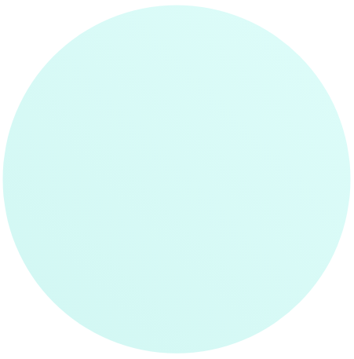

# Personal portfolio 

## Features

- [Summary of the work](#summary)
  - [The Work](#the-work)
  - [Links](#links)
  - [Images of materials used](#images)
- [The process](#the-process)
  - [Built with](#built-with)
  - [New knowledge](#new-knowledge)
- [Authors](#authors)
- [Acknowledgments](#acknowledgments)

## Summary of the work

-This is a basic personal portfolio landing page, created using html and css. This work displays an introduction of me, Faith Madogwe and highlight my proffesion as a Frontend Developer.

### The Work
-Navigation Bar: Includes links to Home, Latest, Category, Services, and Contact.
-Call-to-Action: "About Me" and "Follow Me" Buttons.
-Social Media Links: Icons for Facebook, Instagram, Twitter and Pinterest

### Links

 ### Images of materials used
 
 
 

 ### The Process

-Created a div for the whole work
-Then divs for the logo, search inpute, and nav bar
-Navbar for links
-divs for background image and other image
-divs for social media icons with the various icons in it.
